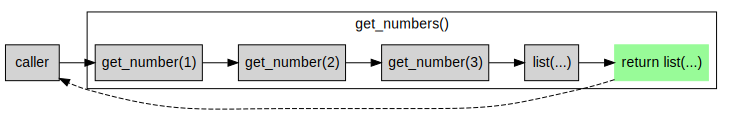
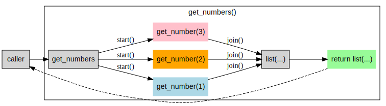
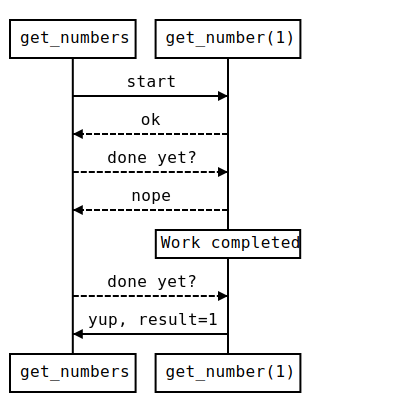
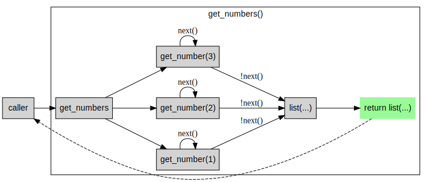
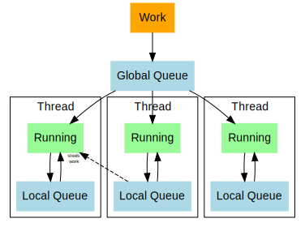

# How Async Works
Modern languages are increasingly moving towards `async` as the default means by which
concurrency and I/O are managed, reducing our visibility into the threads and processes
which underpin our code. The promise is that, by tossing a few `async` and `await`s around
your codebase, you'll achieve scaling nirvana - but as with all magic, there is a dark side.

Over the course of my career, I have spent a lot of time leveraging and debugging asynchronous
code across a range of different languages. One of the things that has helped me do so is
a solid mental model of how a feature like `async` is implemented and the impact that has.
This blog post is my rough attempt at explaining that.

<!-- more -->

## Foundational Concepts
Before we dive into async itself, I want to talk about a few core concepts that will help
ensure we're on the same page in the rest of this post. If you're already familiar with these
things then feel free to skip them.

### Concurrent vs Parallel
In the context of execution, concurrency and parallelism have two similar but distinct meanings.
Concurrency is the property of having multiple tasks active at once, but not necessarily executing
instructions simultaneously. If you are reading a book while the kettle boils then you are concurrently
making tea and reading - but you aren't physically performing actions for both at the same time.

Parallelism is the simultaneous execution of multiple tasks - if your partner is pouring the tea
while you read then that is making tea and reading in parallel.

Async refers to the ability to write code which executes concurrently, but critically this does
not guarantee or even imply parallelism. In some cases, your language or framework may provide
parallelism alongside concurrency, but in others this might not be the case.

### Threads
I'd also like to take the opportunity to call out that hardware threads and software
threads are not equivalent to one another. A hardware thread (depending on your CPU
this might be a 1:1 or 1:2 mapping to physical CPU cores) represents the ability to
execute, for the most part, a single process in parallel with any other hardware threads.

Software threads on the other hand are managed by your Operating System's scheduler and
allow multiple software threads to be mapped onto a smaller number of hardware threads.
While most modern desktops will have somewhere in the order of 8-24 hardware threads,
your operating system is probably managing somewhere in the order of 5k-10k software
threads.

When writing code, we are almost exclusively interested in software threads. In this
context, a thread is represented by a piece of memory containing a program counter,
program stack and some additional metadata. In general, this is somewhere around 1MB
in size and while it can be adjusted, doing so can be risky.

The size of a thread in memory has some serious implications for the scalability of
your workloads, if you need to spawn 8000 threads then you need to have 8GB of memory
sitting around before you even start doing work. Virtual memory and paging can help
here, but at some point you're going to start feeling this.

It is this overhead which acts as one of the primary drivers for moving away from
threads and instead implementing some form of application-level concurrency.

### Green Threads
Different languages will use different names for these: coroutines, fibers, futures,
goroutines, tasks... All of them are an application-level implementation of the same
concurrency and scheduling features found in native operating system threads.

While [Green treads](https://en.wikipedia.org/wiki/Green_threads) themselves started
out as a means of providing threading support on systems which didn't include it in the
OS, today this is primarily used as a means to overcome some of the scalability
limitations of operating system threads by reducing the overhead associated with
the extra concurrency.

## Implementing Async
This might not hold true for everyone, but I find that having an idea about how I would
build something lets me infer a lot about how others have done so. I also find that reading
code can sometimes make things a little bit easier to remember (for me) than a bunch of
diagrams and text. So let's build ourselves a basic `async` framework.

::: warning
I'll preface this with a disclaimer: no production-ready async implementation is
going to be trivial to implement and my quick attempt here is aimed more at the
abstraction than delivering functionality.
:::

I'm going to build from the basics here, with some examples of how we go from a basic
function to an asynchronous one. **For simplicity's sake, we're just going to return
a sequence of numbers, but in practice you'll almost certainly be doing something more
interesting.**

### Synchronous Method
The method we're going to be working with is a simple one. It returns a sequence of
numbers from 1 to 3 (inclusive). Imagine, for arguments sake, that each number needs
to be fetched from a slow database somewhere.

```python
def get_number(n: int) -> int:
    """
    A method which allows us to get a number (in reality, this would be waiting
    for a network request or file system read).
    """
    return n

def get_numbers():
    """
    Gets a few numbers from the database and returns them in a list
    """

    return [
        get_number(1),
        get_number(2),
        get_number(3)
    ]
```

When this method runs, it executes in the following order, waiting for each
call to `get_number(n)` to complete before proceeding to the next.



But `get_number(n)` is meant to be a slow network request in our example, so
there's no work for us to do while we wait for the result of the first call.
How can we change that?

### Threads
The original means of solving this problem is to start a series of threads
and wait for them to complete. This delegates the job of managing concurrent
execution to the operating system's scheduler and, if we ignore the overhead
that it introduces, it is an elegant solution to the problem at hand.

But threads (as we covered earlier) are relatively heavy constructs and the
operating system scheduler doesn't have any inherent knowledge about your
application and what it is trying to achieve. This makes threads potentially
costly, especially when you start spinning up thousands of them.

```python{35,38}
from threading import Thread

class GetNumberThread(Thread):
    """
    We create a new thread class to fetch these numbers
    """

    def __init__(self, n: int):
        super().__init__(self)

        self.n = n
        self.result = None

    def run(self):
        """
        A method which allows us to get a number (in reality, this would be
        waiting for a network request or file system read)
        """

        self.result = n


def get_numbers():
    """
    Gets a few numbers from the database and returns them in a list
    """

    threads = [
        GetNumberThread(1),
        GetNumberThread(2),
        GetNumberThread(3),
    ]

    for thread in threads:
        thread.start()

    for thread in threads:
        thread.join()

    return [
        thread.result
        for thread in threads
    ]
    
```

This results in the execution "fanning out" and then combining again to
arrive at the final result.



At first glance, this looks pretty good - but the diagram does a good job
of lying to you by omission. Recall that the caller is waiting on the
`get_numbers()` method to complete and until it does, the thread on which
the caller is running is completely blocked.

This isn't necessarily a problem if your caller has a dedicated thread,
but the more parts of your application need to have a dedicated thread to
avoid blocking each other, the more you start to regret the amount of
data that needs to be stored for each thread.

So with this in mind, how can we get the best of both worlds? Let's start
by making the observation that in our example here, we are doing a lot of
waiting (on that imaginary slow database) and the threads are blocked
as a result. Instead of blocking, let's try and do other work instead.

### State Machines
One way to avoid blocking is to use polling to see whether a given piece
of work has completed. In general, polling is expensive and that's one
of the big reasons why threads use blocking instead. But in a world of
compromises, it might be cheaper to poll 10,000 tasks to see which have
completed than it would be to create and schedule 10,000 threads to do
the same.

With that trade-off in mind, let's look at how we could implement a
solution which allows us to leverage a single thread to run multiple
concurrent steps. To do so, we'll implement a state machine which can
be executed in small, bite-sized, steps - sharing the thread with its
peers.

We're going to focus on enabling the caller and each state machine to
have a conversation which can be modelled as a [Deterministic Acyclic Finite State
Automaton](https://en.wikipedia.org/wiki/Deterministic_acyclic_finite_state_automaton).

<p style="text-align: center">


</p>

We can implement this state machine pattern using something like the following:

```python{12-27,49}
class GetNumberStateMachine(object):
    """
    A class which implements a state machine which will fetch
    a number (from a database, for example).
    """

    def __init__(self, n: int):
        self.n = n
        self.state = "START"
        self.result = None

    def next(self) -> bool:
        """
        This method attempts to move to the next state in the
        state machine and returns True if the state is non-terminal
        (i.e. we have not reached the end).
        """

        if self.state == "START":
            self.state = "FETCHING"
            return True

        if self.state == "FETCHING":
            self.state = "DONE"
            self.result = self.n

        return False

def get_numbers():
    """
    Gets a few numbers from the database and returns them in a list
    """

    machines = [
        GetNumberStateMachine(1),
        GetNumberStateMachine(2),
        GetNumberStateMachine(3)
    ]

    # Build up a list of all of the state machines which still have work to do
    outstanding_machines = machines

    # While we have state machines with outstanding work
    while outstanding_machines:
        # Call the next() method and remove any which return false (no more work to do)
        outstanding_machines = [
            machine
            for machine in outstanding_machines
            if machine.next()
        ]

    return [
        machine.result
        for machine in machines
    ]

```

When we run this, the execution flow looks something akin to this. The
important thing to note here is that we're never leaving the calling
thread to do this work but we are still able to run multiple concurrent
state machines. This is a great example of the different between concurrency
and parallelism.



### Re-entrant Functions
In languages which allow you to pass functions as values, you can take advantage of this
and [Closures](https://en.wikipedia.org/wiki/Closure_(computer_programming)) to remove
the need for a state machine `class`. While this doesn't change the nature of how the
implementation runs, it gets us one step closer to simplifying the implementation.

```python{10-18,39}
from typing import Callable, Union

def get_number(n) -> Callable[[], Union[int, None]]:
    """
    A function which returns a re-entrant method which will
    eventually return the number.
    """

    state = "START"
    def next():
        if state == "START":
            state = "FETCHING"
            return None

        if state == "FETCHING":
            state = "DONE"
        
        return n

def get_number():
    """
    Gets a few numbers from the database and returns them in a list
    """

    machines = [
        get_number(1),
        get_number(2),
        get_number(3)
    ]

    results = [
        None for machine in machines
    ]

    # While we have state machines which have not provided results, get their
    # latest results
    while any(result is None for result in results):
        results = [
            results[i] if results[i] is not None else machine()
            for i, machine in enumerate(machines)
        ]

    return results
```

As with the state machine flow, this code executes on a single thread and allows
us to run all of the `get_numbers()` calls concurrently, calling the (hidden)
`next()` method until we receive the result we are looking for.


### Iterators and Generators
If you're sitting there thinking *"This looks a lot like iterator/enumerator/generator pattern"*
then congratulations, you're one step ahead of me. Iterators are designed to
allow a sequence to be exposed one item at a time and can allow the efficient
generation of infinite sequences.

You'll find these in a number of languages and in most cases the interface is
extremely similar.

:::: code-group

::: code-group-item C#
```csharp
/// <summary>
/// An interface which describes an iterator in C#, along with its
/// <c>next()</c> method and <c>current</c> item.
/// </summary>
public interface IEnumerator<T>
{
    /// <summary>
    /// Moves the iterator to the next item and returns <c>true</c>
    /// or <c>false</c> if there is no next item.
    /// </summary>
    bool MoveNext();

    /// <summary>
    /// Gets the current item that the iterator points to.
    /// </summary>
    T Current { get; }
}
```
:::

::: code-group-item Python
```python
class Iterator:
    """
    A sample class showing what an iterator might look like in Python.
    """

    def __next__(self):
        # If we have a next item
        return current

        # If we have reached the end of the sequence
        raise StopIteration
        
```
:::

::::

Some of these languages go one step further and provide
[syntax sugar](https://en.wikipedia.org/wiki/Syntactic_sugar) to make
working with iterators even nicer. Let's try rewriting our re-entrant
function to take advantage of Python's `yield` keyword to construct
an iterator for us.

Each time we attempt to retrieve the next item from the iterator, we
will proceed to the next `yield` in our function, allowing us to take
bite-sized chunks out of our process and giving ourselves the ability
to execute multiple functions concurrently.


```python{9-13,35}
from typing import Union

def get_number(n) -> Iterator[Union[int, None]]:
    """
    A function which returns a re-entrant method which will
    eventually return the number.
    """

    # We're not done yet
    yield None

    # Now we're done
    yield n

def get_number():
    """
    Gets a few numbers from the database and returns them in a list
    """

    machines = [
        get_number(1),
        get_number(2),
        get_number(3)
    ]

    results = [
        None for machine in machines
    ]

    # While we have state machines which have not provided results, get their
    # latest results
    while any(result is None for result in results):
        results = [
            # StopIteration handling elided for brevity
            results[i] if results[i] is not None else next(machine)
            for i, machine in enumerate(machines)
        ]

    return results
```

::: danger
If you're looking at this and wondering what happens if you only have one
`yield` in your function: you've just stumbled into what happens if you
run synchronous, blocking, code within an `async` method.

Looking at the
code above, you can see how this would cause the first function to be
executed completely before the second and so on - removing the ability
to run concurrently.

This is why people sometimes say that "async is contagious" - you need
to use it everywhere you would block before you see the benefits.
:::


This code executes identically to the re-entrant functions example, but simplifying
the `get_number()` function starts to highlight something interesting:
how we can wait for concurrent work within our functions.

```python{7-8,17-18}
from typing import Union
from datetime import datetime, timedelta

def wait_n(n):
    # This is a bad non-blocking version of sleep()
    target = datetime.utcnow() + timedelta(seconds=n)
    while datetime.utcnow() < target:
        yield None

def get_number(n) -> Iterator[Union[int, None]]:
    """
    A function which returns a re-entrant method which will
    eventually return the number.
    """

    # Let's call wait_n and return the result once we have it
    for x in wait_n(n):
        yield x

    yield n
```

::: danger
So what happens if we don't `yield` while we wait for `wait_n()` to complete on line 18?
Well, turns out that's another *Really Bad&trade;* idea in the async world. It's called
**Sync over Async** and it occurs when you *synchronously wait for the result of an
asynchronous operation*.

In this case the impact is limited to effectively blocking the calling thread and forcing
us back into synchronous execution territory, but in cases where you have a thread pool of
workers waiting on work from one another, this can result in thread pool starvation and
deadlock.
:::

### Async Syntax
At this point, we've got all of the constructs necessary to model an interruptible
sequence of execution and we have some syntax which is relatively nice, but not perfect.
So to fix this, we go and make friends with the compiler maintainers and convince them to
write all of this code for us.

Compiler maintainers are awesome folks, but they're also lazy (in the best possible way)
and so they're far more likely to add features to the compiler which solve this problem
than they are to help write your code for you. That's how we end up with `async`/`await`.

```python{4,7,11}
import asyncio

async def wait_n(n):
    await asyncio.sleep(delay=n)

async def get_number(n):
    await wait_n(n)
    return n

async def get_numbers():
    return await asyncio.gather(
        get_number(1),
        get_number(2),
        get_number(3),
    )
```

Behind the scenes, the `async` keyword is essentially asking the compiler to convert your
method into a state machine and every time you write `await` you are telling the compiler
to introduce a state-loop which polls for the completion of another `async` method.

Most languages don't use pure iterators for this, opting to use things like Promises,
Tasks and Futures to describe these ongoing operations, but the basics are all the
same. They'll also provide helpers for running multiple operations concurrently (things
like `asyncio.gather`, `Task.WhenAll` and `Promise.all`), or racing multiple operations
to see which completes first.

## Parallel Async
You'll also find that many languages which integrate `async` will include support for
some form of parallel execution on a thread pool. This might sound a bit crazy initially,
after all, wasn't the entire point of this endeavour to avoid the overhead of extra threads?
In practice, though, most applications can benefit from some degree of parallel execution
and any application which intends to use more than 10% of a modern desktop's compute
capacity is practically required to use threads.

I'm by no means smart enough to write a thread-pool based async executor in a blog post
so I won't embarrass myself by trying, but it is worth talking about some of the underlying
patterns you'll find in those implementations since it might help you reason about how
your code runs in production.

Consider the following diagram, which shows the logical components which make up a modern
(.NET Core-esque) async worker pool.

<p style="text-align: center;">


</p>


Start off with a pool of threads and a global work queue. Any new work you want to execute
(an `async` call) gets dropped into this queue. The threads in your pool then compete to
pick up items from this global queue and start working on them. When an item needs to
yield, it gets placed on a thread-local queue (to help with CPU L2/L3 cache locality)
and the thread then looks for the next piece of work.

In situations where a thread has exhausted its local queue and the global queue is
also empty, it may steal work from its peers. This helps avoid the head-of-line blocking
problem without forfeiting our cache locality optimizations. If your framework is
particularly smart, it'll queue new work directly onto the local queue of the parent
task (again, to optimize for cache locality).

::: warning
In some frameworks, the number of workers is constant or bounded, while in others
it may grow depending on how saturated the worker threads are. This steady growth
can, in some cases, mask a Sync over Async deadlock by trickling new threads into
the pool in an effort to unblock things.
:::

## Closing Thoughts
I'll re-iterate again that real world async implementations are far more complex than
what I've highlighted here. Most support thread pools for a combination of concurrency
and parallelism, many act as general abstractions over concurrent execution - greatly
reducing the need to reason about threads within your code. They are also required to
handle a thousand edge cases, maintain execution context, optimize for performance and
processor cache locality and a a wide range of problems I have completely ignored here.

With all that being said, however, you can probably develop a pretty solid understanding
of how async works with just this basic mental model and hopefully this helps reveal
some of the magic that underpins an immensely powerful tool.

The main thing to keep in mind is that `async`'s biggest strength and weakness is that
it is concurrent but not necessarily parallel. If you treat `async` as though you only
have one thread to work with and cannot afford to block it, you'll probably tend towards
making good decisions. If you treat it like free multi-threading, you're probably going
to have a bad time.

::: tip
If the problem you're trying to solve involves a lot of twiddling your thumbs while you
wait for things, `async` is your best friend. If it involves doing a lot of computation,
`async` is going to make things worse.

The caveat to this is that `async` cannot make waiting faster - just let you wait for more
things at the same time and work on others while you wait. It also can be used as an
abstraction over threads
:::

As a final thought: this is a complex space and I'm sure there is plenty I have
omitted or failed to capture effectively. If you have feedback or corrections, please
let me know by proposing a change/opening an issue.