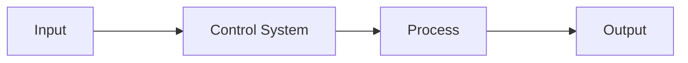
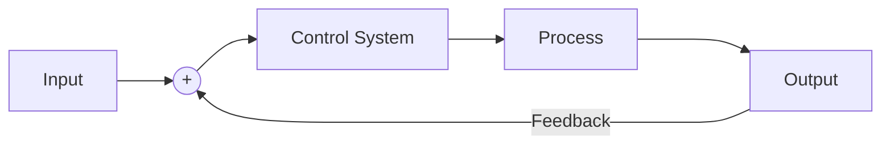

# Inner-Loop Planning for SRE Teams
When it comes to planning and strategy; Site Reliability Engineering teams walk a fine line.
On one side of this line is a team who is closely aligned with the product group's priorities,
to the point where they cannot be distinguished from one another (staff augmentation). On the
other side is a separate operations team who only peripherally works on the same product as
the product group.

Neither of these extremes is healthy and a well functioning SRE team will attempt to strike a
balance between the two. In my mind, our goal is to balance the broomstick in the palm of our
hand. This kind of balance trick is one that every control systems engineer is familiar with
and the technique for solving it is a well trodden path. Let's discuss it and use it to formulate
a method for planning how your team works on a daily basis.

<!-- more -->

## Background
### Disclaimer
I'll start out by saying that I'm no management consultant, I've read far fewer books on the
topic than several of my colleagues and I'm young enough that I've still got plenty of mistakes
left to make in my career. With that being said, there's never going to be a one-size-fits-all
approach to supporting humans. The best we can do is listen to them and hear the feedback they
offer, test our hypotheses and constantly learn from our mistakes. Please do all of that if you
want to try and employ some of the ideas I talk about here.

### Control Systems
Let's talk about open and closed loop control systems. An open loop control system is the simplest
one you're going to find and it is characterized by a complete disregard for the impact it has
on the world. I'm sure we've all worked folks who fall into that category...

The main problem with open loop control is that it is fundamentally incapable of responding
to changing circumstances. It is possible, for example, to design an open loop controller which
knows that a certain amount of accelerator is required to overcome air resistance and drive
your car to 120km/h - however the moment you hit a downhill, you're going to be going a hell
of a lot over the speed limit and I'm not sure the police are going to let you point the
finger at the cruise control.

To address this, we introduce the concept of feedback - letting the controller compare the output
to what was requested and making adjustments as necessary.

In theory, this solves everything since the controller is now able to make corrections to
the process until the output matches what is expected. In practice, however, things can get
a bit more tricky. See, in the real world things don't happen instantly (for various reasons
relating to infinite energy consumption) and not everything responds in a predictable manner.

For the first problem, we need to settle for reasonable sampling frequencies and for the second
problem we need to resort to higher-order controllers with the ability to model the system's
behaviour. In the engineering management world, the idea of "hire better management" doesn't
tend to fly as the fix for everything, so let's talk about the first problem quickly.

### The Nyquist Theorem
Picture yourself sitting on the rocks by the ocean. You've brought along your tape measure and are
checking the height of the waves as they pass you in the hopes of figuring out their frequency.
Every few seconds you glance at the height of the water and write it down in your notebook, but
you notice something weird - it doesn't look like there are any waves (all of your water height
measurements are about the same).

This confuses you, obviously you can see that there are waves, but when you measure them they
seem to disappear. So you bring over a friend to help and start reading out the heights far more
quickly, with them writing down the results. Success, you can now see the waves in your readings!

This is called aliasing and it occurs when the rate at which you are sampling a periodic signal
is too low, causing you to only be able to see a lower-frequency (harmonic) of the main signal.
It turns out that we've known about this problem and been able to mathematically prove its solution
since the early 1900's. The answer is that, in order to accurately sample a signal, your sampling
rate must be at least twice the highest frequency component of the signal.

## Identifying the Problem
> Okay, but what the hell do control systems and aliasing have to do with how my team plans their work?

That's a great question. Let's consider how your team operates for a second. If you're anything
like the SRE teams I've worked on, there's a lot of long-term work which you're looking to tackle
and plenty of interrupt-driven work constantly landing on people's plates. Some of that
interrupt-driven work is stuff that can be cleared away within a few minutes or a day, but sometimes
it is the result of having just learned that your entire storage strategy cannot scale much
beyond your current capacity and everything is now on fire.

Ask yourself, honestly, how frequently the priorities on your team change and how frequently
the work your engineers do needs to adapt to suit that. Then ask yourself how frequently your team
evaluates the priorities of what they're working on and makes adjustments. The Nyquist theorem says
that the sampling frequency (your planning frequency) should be twice what the signal's frequency
(changes in requirements) is. Whether that's true for your team or not depends a lot on how you
work and how predictable some of the other aspects of your work are.

Assuming for a second that you're working in an environment like ours, predictability is a
luxury you probably rarely get to experience. Having planning cycles which extend out into
the quarter/semester and expecting to be able to work on those planned pieces of work has,
in our experience, been fraught with difficulty. With a great team it is possible, but it
is stressful and leaves engineers feeling like the work they're doing on a daily basis doesn't
align with what is expected of them.

That's not healthy and it's not the way we want our teams to work. So, taking inspiration from
Nyquist, we have done some shuffling around.

### How we measure impact
The first observation is not a technical one, but rather a sociological one. As members of a
team, we evaluate our own impact based on alignment with the stated goals of the team. If the
work we're doing differs from what the team sets out to do, we're not going to feel like we're
contributing.

For example, an engineer tasked with building a new deployment system which enables faster
identification and mitigation of issues might need to balance that investment against mitigating
the most recent issue introduced in a deployment. Both of these have value and both are necessary,
but in many organizations only the first is recognized as "having impact".

### How we prioritize
When an engineer is prioritizing the work they are doing, there are several factors which bear
consideration. A neat way to visualize this is using Maslow's Hierarchy of Needs. If a decision
(one way or another) could impact the engineer's physiological or safety state (i.e. they could lose their
job) then that will be their highest priority. Next will be requests that come from friends and
close colleagues, followed by things that excite them and only at the very end of that list will
be the kinds of things that we think of as "insightful".

This is empirically the way that our engineers tend to prioritize their work: anything that might
have senior leadership call them out for failing to do their job will get their immediate focus.
The most obvious case of this is any high-impact incident, where the cost of failing to prioritize
can be significant. This is the work that is most likely to drive stress within your team and
managing it effectively is crucial to supporting their mental health.

Then you'll see engineers helping out their colleagues with reviews, suggestions
and work that unblocks them - this is most obvious if you find yourself in an environment where
"making friends" is the most effective way to move things along. That's great, but this is
also the work that contributes the least to an individual's ability to demonstrate their
own value (and they'll probably know this).

At that point, the prioritization shifts to things that might start to help your strategic
delivery - but again, the work that's likely to get prioritized the highest is the stuff that
allows engineers to feel an immediate sense of accomplishment: so small, simple tasks which
they are confident they can deliver on. If you've found your team churning through the easy
work and not tackling the hard stuff then that might be why.

The last rung on the prioritization ladder is going to be work that requires your engineers to
develop novel solutions to problems, be creative and investigate complex problem spaces. This
is the work that often is required to deliver large, complex, projects and it's the same work
that we use to benchmark the seniority of our engineers.

So with that in mind, surely the biggest hinderance to our engineers developing their critical
thinking skills and rapidly becoming more senior is that we've got systems which incentivize
working on things at the other end of the spectrum?

## A solution
Quite simply, let's accept that we work in an environment where priorities need to change
frequently. Let's also assume that everyone is doing their best to work on the highest priority
work at any given time.

If that's the case, then the most effective way we can ensure alignment is by regularly
touching base on priorities and discussing how those align with our strategic objectives
and team goals. That needs to happen at a cadence above our Nyquist frequency and should
strive to move as much of our work as possible out of the "Physiological/Safety" portion
of Maslow's hierarchy and into the Esteem/Self-Actualization portion.

To accomplish this, our inner planning loop is only 1 week long. Every Monday we sit down
as a group and review the work that stands before us, stack ranking its importance for
each engineer and coming up with their priorities for the next week. These aren't expected
deliverables, this is just the stuff they will be focusing on (in order of importance).

We also capture any risks that the team might be aware of which could interrupt the engineer
over that period and briefly discuss our strategies for dealing with them. These could be
things like *"we're rolling out a new change to X and I might be dragged into that if there's
an issue"*.

::: tip
The goal of these priorities and risks is to give your engineers a playbook which lets them
make decisions about how they approach work during the week. If anything new crops up, they
can rank it against their existing priorities and make a decision about how to proceed and,
if you've done a good job, the trade-offs they make will mirror your own.
:::

At the end of the week, we meet again and do a retrospective on the week's work. Our measure
of success is how much of our time was spent working on the most important stuff relative
to our total time spent working. In an ideal world, we would only work on the most important
things, but in reality there's plenty to distract us or demand attention.

We're using this as a chance to reflect on our prioritization of those interrupts and refine 
our internal priority gauges. If we mis-prioritized something, we'll talk about what factored
into that and what we could have known beforehand. If we correctly prioritized something, we'll
talk about how we got it right and share that.

Having these meetings regularly means that we're able to, in most cases, defer the prioritization
of new work (even if it is urgent) until the next meeting, since the average time before an item
can be prioritized by the group is only 2.5 work days. Crucially though, separating delivery
from prioritization means that (unlike sprints) we can reduce the ceremony around planning and
focus on execution.

If done well, this system gives every member of the team the context they need to make accurate,
high-frequency, decisions about priorities without needing to centralize the decision making
process. Going back to our control systems analogy, this is like teaching your engineers how
to balance the broom on their hand, rather than telling them where to move their hand while
the broom falls.

## Putting it into practice

### Discussing Priorities and Risks
The first thing to keep in mind is that the goal of this process is to encourage your
engineers to make their own prioritization decisions and to refine the decision making
process that they use such that it aligns with your team's strategic objectives.

So start out by asking them how they feel their work should be prioritized. Discuss your
upcoming road-map with them and use this to help guide their prioritization. If there
are disagreements, work to understand what the engineers are trying to achieve and whether
that needs to inform changes to the road map or your incentive structure.

Now is also the time to go through your triage queue and decide what work should be picked
up and how it should be prioritized against your strategic goals. Doing this at the start
of each week means that your stakeholders will often get quick responses to their requests
and it lets your engineers defer processing of those requests until this meeting.

::: tip
The priorities list should be relevant to each engineer's area of focus and should include
both things they plan on tackling during the week as well as things that they do not expect
to get to. These prioritized items act as landmarks against which other work can be compared.
:::

Once an engineer has their priorities listed, ask them what risks they foresee over the course
of the week. Are they on-call, or responsible for something which is going through a period of
change? Are they aware of anything that might require their attention, or which could change the
prioritization of the items they have listed? Capture these and adjust the priorities list
as necessary.

### Conducting a Retrospective
At the end of the week, it's time to ask how things went. Remember that the goal of this
process is to ensure that your engineers are able to work on the important things, not to
guarantee delivery on a given schedule. So avoid questions or discussions about when things
will be delivered or how close they are to delivery (priorities can change).

Instead, focus your questions on how your engineers felt the week went. Did they feel like
they were able to work on the items they had prioritized and, if not, what got in the way?
When problems are identified, you should work with your engineers to identify strategies
that enable everyone to respond in a constructive manner (and that might mean dealing with
those interrupts when they appear).

### Template
The template we're using for these meetings is really straightforward, we're not trying to
capture too much information or replace existing planning tools. Instead, this is meant
to be something that engineers can consult during the week whenever they are trying to
figure out what to work on.

::: tip
The prioritized list of work captured here is **NOT** expected to be delivered during the
course of the week. Success is measured on whether the time spent working is on the most
important stuff, rather than on whether something was completed.
:::

---

> #### Person A
> **Priorities** (*at the start of the week*)
> 1. Thing X
> 2. Thing Y
> 3. Thing Z
> 
> **Risks** (*at the start of the week*)
> - A could happen
> - B could be true
> - C is an unknown
> 
> **Remarks** (*at the end of the week*)
> - X went well
> - Started on Y, but B turned out to be true, which blocked me there
> - Learnt more about C and now Z doesn't seem important

---

